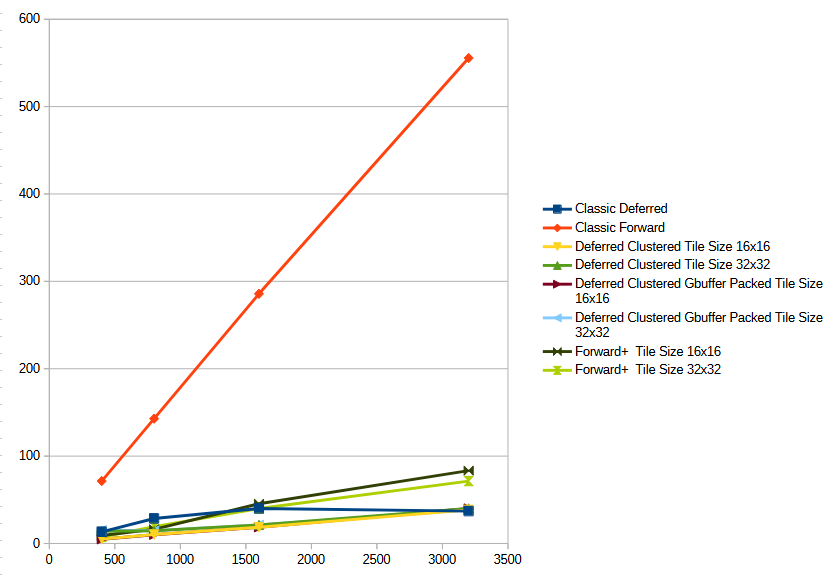
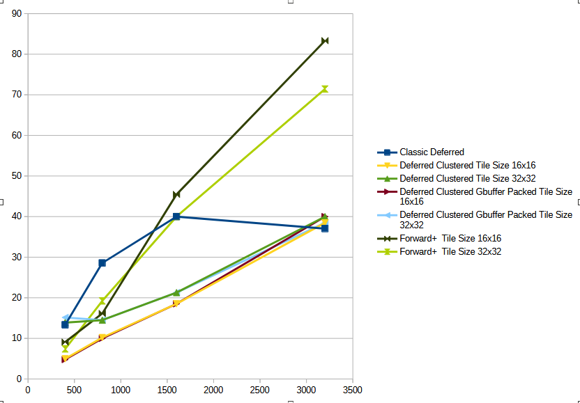

WebGL Forward+ and Clustered Deferred Shading
======================

**University of Pennsylvania, CIS 565: GPU Programming and Architecture, Project 4**

* Henry Han
  * https://github.com/sirenri2001
  * https://www.linkedin.com/in/henry-han-a832a6284/
* Tested on: Windows 11 Pro 24H2, i7-9750H @ 2.60GHz 16GB, RTX 2070 Max-Q

### Live Demo

[Live Demo](https://sirenri2001.github.io/Project4-WebGPU-Forward-Plus-and-Clustered-Deferred)

### Demo Video/GIF

## Tasks Completed

- Classic Forward Rendering
- Forward+ Rendering
- Deferred Rendering with Cluster light culling

**Extra Credits!**

- GBuffer Compression with value packing

## Performance Analysis

**1. Key Observations**

Performance Ranking: Overall, Deferred Clustered rendering, especially with a Packed G-Buffer, delivers the best performance across all light counts. Forward+ is the second-best performer, while Classic Forward rendering performs the worst by a significant margin.

Impact of Light Count: The performance of all rendering methods degrades as the number of lights increases. Classic Forward is the most sensitive to this increase, suffering from an extreme performance penalty.

Tile Size Impact: For tiled rendering methods (Deferred Clustered and Forward+), a 16x16 tile size generally provides better performance than a 32x32 tile size, especially at higher light counts.

**2. Detailed Analysis**

*Classic Forward*

Even with a low count of 400 lights, the frame time is already very high at 71.4ms, making it far slower than other methods.

When the light count increases to 3200, the frame time soars to 555.6ms, making real-time rendering nearly impossible. This shows that Classic Forward is not suitable for handling a large number of dynamic lights.

*Classic Deferred*

Significantly better than Classic Forward. However, at high light counts (1600+), it is outperformed by the tiled methods. Its performance shows some fluctuation at 3200 lights, which could be due to optimization or measurement variance.

*Forward+*

The tiling technique dramatically improves upon classic forward rendering. At 400 lights, it achieves a low frame time of 7.4ms.

However, under very high light loads (1600+), its performance begins to lag behind Deferred Clustered.

*Deferred Clustered*

This is the best-performing method overall. With 400 lights, it achieves an excellent frame time of 4.98ms, enabling very high frame rates.

Even under the extreme load of 3200 lights, it maintains a manageable frame time of 38.5ms.

The Packed G-Buffer version provides a slight performance boost or matches the standard version in most cases, confirming its optimization benefit.

**Impact of Light Count on Performance**

Using the best performer, Deferred Clustered (Packed, 16x16), as a benchmark:

As lights increase from 400 to 3200 (8x), the frame time increases from 4.78ms to 40ms (~8.4x). The performance degradation is roughly linear but remains controllable.

Using the worst performer, Classic Forward, for contrast:

The same increase in lights causes the frame time to jump from 71.4ms to 555.6ms (~7.8x). While the multiplier is similar, the massive base frame time means the experience goes from "sluggish" to "unusable."

**Impact of Tile Size**

- For Deferred Clustered: A 16x16 tile size outperforms a 32x32 tile size in almost every test scenario. Smaller tiles allow for more precise light culling, reducing the number of lighting calculations per pixel.

- For Forward+: At low light counts (400), a 32x32 tile performs better (7.41ms vs. 9.09ms), likely due to lower overhead.

- At higher light counts (800+), the advantage of 16x16 tiles becomes apparent, and it takes the performance lead.

### Credits

- [Vite](https://vitejs.dev/)
- [loaders.gl](https://loaders.gl/)
- [dat.GUI](https://github.com/dataarts/dat.gui)
- [stats.js](https://github.com/mrdoob/stats.js)
- [wgpu-matrix](https://github.com/greggman/wgpu-matrix)
